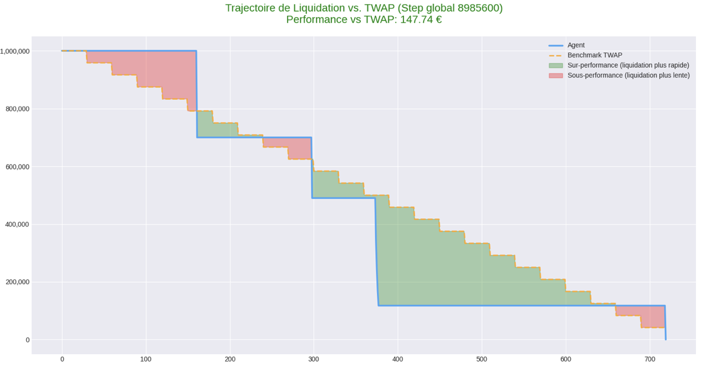
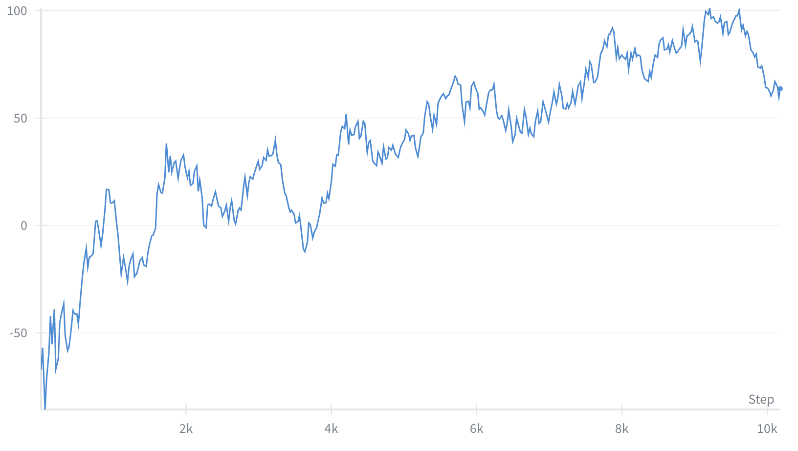

<h1 align="center">Reinforcement Learning for Optimal Execution Algorithms</h1>

  <em>A Master's Thesis on developing an autonomous trading agent to generate consistent execution alpha.</em>

  
  

---

<table>
  <tr>
    <td width="25%"><strong>Author</strong></td>
    <td>Ethan Chemla</td>
  </tr>
  <tr>
    <td><strong>University</strong></td>
    <td>   University Paris Dauphine - PSL</td>
  </tr>
  <tr>
    <td><strong>In collaboration with</strong></td>
    <td>   Execution Algo Team at Natixis CIB</td>
  </tr>
  <tr>
    <td><strong>Degree</strong></td>
    <td>M2 Artificial Intelligence, Systems and Data (IASD)</td>
  </tr>
  <tr>
    <td><strong>Status</strong></td>
    <td>Defended September 17, 2025</td>
  </tr>
</table>

---

## Thesis Overview

This project moves beyond simple market prediction to develop a complete, autonomous trading agent capable of generating consistent execution alpha in complex financial markets. The core contribution is a fully integrated Reinforcement Learning (RL) pipeline that bridges the critical gap between forecasting and optimal action.

### Phase 1: Building a Predictive Foundation

The first phase focused on engineering a robust predictive signal from high-frequency data.

* **Novel Feature Engineering**: Two original, theory-driven features were developed to capture market dynamics:
    * **Noise Range Percentage (NRP)**: An adaptive oscillator designed to identify temporary, mean-reverting price deviations from a dynamic local trend.
    * **Adaptive Trend Finder (ATF)**: A mechanism that dynamically identifies the most statistically significant trend timescale.
* **Supervised Model Training**: Advanced models (XGBoost, ResNet) were trained on these features to generate high-level probabilistic forecasts. These predictions are not the final output, but rather a key input for the RL agent.

### Phase 2: The Autonomous Execution Agent

The second phase implemented the end-to-end reinforcement learning framework to transform predictive signals into an optimal execution policy.

* **RL Framework**:
    * **Algorithm**: An agent based on **Proximal Policy Optimization (PPO)** was trained to intelligently liquidate a significant position over a finite horizon.
    * **Custom Environment**: The agent learns within a custom-built optimal liquidation environment.
    * **Reward Function**: The agent's learning is guided by a sophisticated reward function designed to maximize financial outperformance against a **Time-Weighted Average Price (TWAP)** benchmark, including penalties for market impact and incomplete liquidation.
    * **Policy Network**: The agent leverages a hybrid **CNN-LSTM architecture** to effectively process the temporal nature of the market state.

## 🏆 Key Results & Achievements

- **Generated Positive Alpha**: Achieved an average alpha of **+$42.19 per episode** against the industry-standard TWAP benchmark on an out-of-sample dataset.
- **Consistent Win Rate**: Outperformed the TWAP benchmark in **55.57%** of the 3000 test episodes, demonstrating a significant predictive edge.
- **High Reliability**: Successfully liquidated **99.5%** of the initial position across all episodes, confirming the effectiveness of the penalty-driven reward function.
- **Novel Feature Engineering**: Developed two original, theory-driven features: the **Noise Range Percentage (NRP)** for mean-reversion and the **Adaptive Trend Finder (ATF)** for dynamic trend identification.

---

## 🛠️ Methodology & Keywords

- **Core Algorithm**: Proximal Policy Optimization (PPO)
- **Policy Network**: Hybrid CNN-LSTM Architecture
- **Core Problem**: Optimal Liquidation / Algorithmic Execution
- **Predictive Models**: XGBoost, ResNet
- **Key Concepts**: Markov Decision Process (MDP), TWAP Benchmark, Mean Reversion, Momentum, Kalman Filtering, Isotonic Regression

---

## 📊 Visualizations

**Example of the agent's adaptive liquidation strategy compared to the static TWAP benchmark. Green areas show an aggressive (faster) liquidation pace, while red shows a passive (slower) pace.**

**Evolution of the agent's performance (PnL difference vs. TWAP) over the training period, smoothed with a 5000-episode moving average, demonstrating a clear and robust learning curve.**

**Evaluation on the out-of-sample set of the pnl difference**

---

## 📜 Read the Full Thesis

For a complete breakdown of the methodology, mathematical formulations, and detailed results, you can access the full PDF here:

**[➡️ Download the Full Thesis (PDF)](Masters_Thesis.pdf)**
